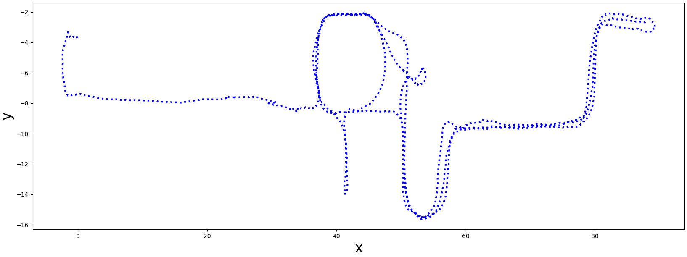
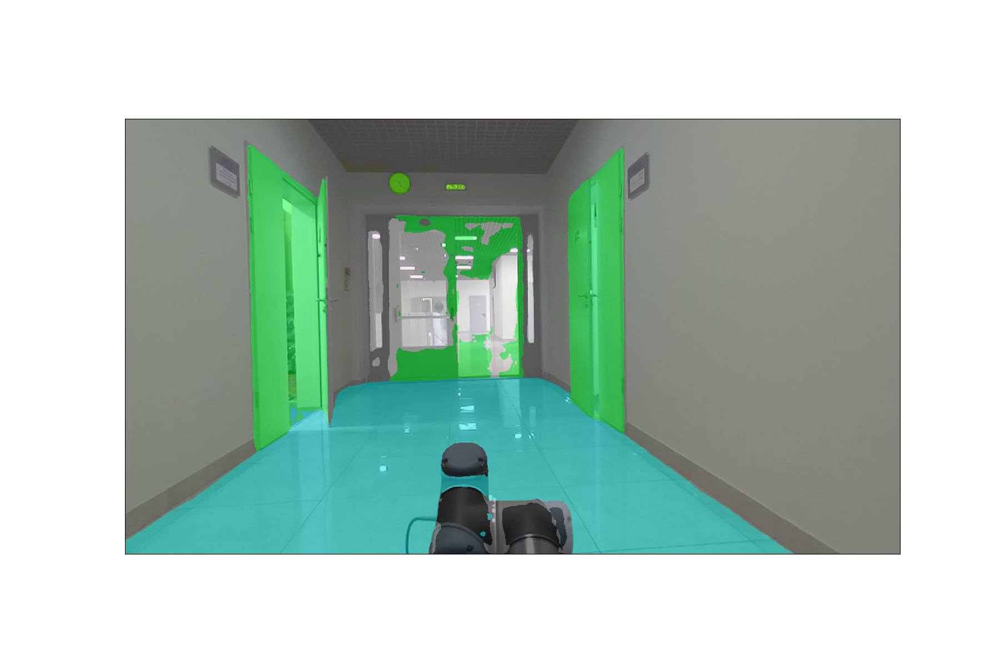
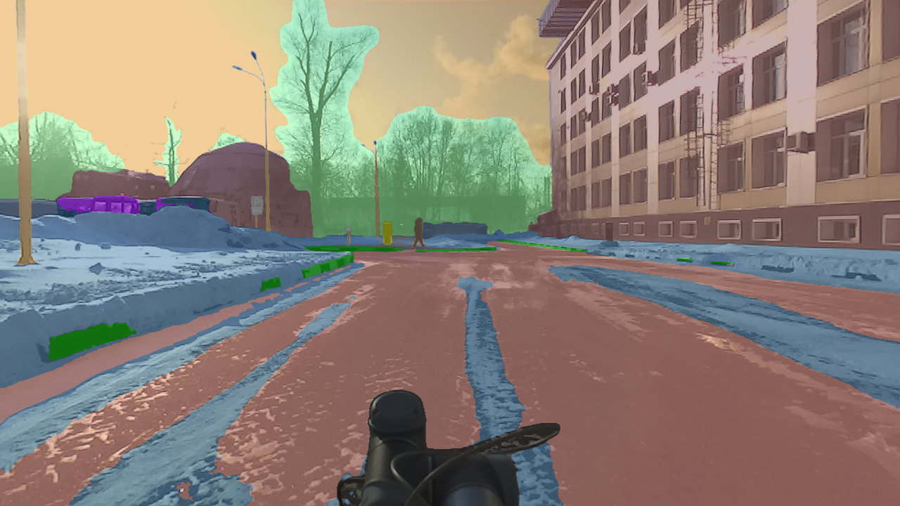

# ITLP-Campus

## Download

| Cloud Storage | link |
|  :---: | :---: |
| Google Drive | [link](https://drive.google.com/drive/folders/14-0Ew5qVWh607tdFsovbXZsdWX-vU-Vy?usp=sharing) |
<!-- | Yandex Disk | [link](https://disk.yandex.ru/d/mw4qmSfCBEAh7w) | -->
<br/>


## Sensors

| Sensor | Model | Resolution |
|  :---: | :---: | :---: |
| Front cam | ZED (stereo) | $1280\times 720$ |
| Back cam | RealSense D435 | $1280\times 720$ |
| LiDAR | VLP-16 | $16\times 1824$ |
<br/>

## Structure

The data are organized by tracks, the length of one track is about 3 km, each track includes about 600 frames. The distance between adjacent frames is ~5 m.

The structure of track data storage is as follows:
```text
Track ##
├── back_cam
│   ├── ####.png
│   └── ####.png
├── front_cam
│   ├── ####.png
│   └── ####.png
├── masks
│   ├── back_cam
│   │   ├── ####.png
│   │   └── ####.png
│   └── front_cam
│       ├── ####.png
│       └── ####.png
├── text_descriptions
│   ├── back_cam_text.csv
│   └── front_cam_text.csv
├── text_labels
│   ├── back_cam_text_labels.csv
│   └── front_cam_text_labels.csv
├── aruco_labels
│   ├── back_cam_aruco_labels.csv
│   └── front_cam_aruco_labels.csv
├── lidar
│   ├── ####.bin
│   └── ####.bin
├── demo.mp4
├── track.csv
├── meta_info.yml
└── track_map.png
```

where

- `####` - file name, which is the timestamp of the image/scan (virtual timestamp of the moment when the image/scan was taken)
- `.bin` - files - LiDAR scans in binary format
- `.png` - images and semantic masks
- `.csv` :
    - `<cam>_text.csv` - text description of the scene for both front and back camera images (image timestamp, text description of the scene)
    - `<cam>_aruco_labels.csv` - information about aruco tags (image timestamp, tag bboxes and its ID)
    - `<cam>_text_labels.csv` - information only about images with text markings (image timestamp, marking bbox , text on the marking)
    - `track.csv` - timestamp mapping for all data and 6DoF robot poses
- `.yml` - meta information about track


An example of a **outdoor** track trajectory  (track_map.png):


An example of a **indoor** track trajectory  (track_map.png):


## Indoor

### Data

| Track | Frames, pcs | Front cam, res | Back cam, res | LiDAR, rays | 6 DoF pose | Semantic masks | Aruco tag | OCR Text labels |
|  :---: | :---: | :---: | :---: | :---: | :---: | :---: | :---: | :---: |
| 2023-03-13 | $3883$ | $1280\times 720$ | $1280\times 720$ | 16 | &#9745; | $1280	\times 720 \times 150$  | &#9745; | &#9745; |
| 00_2023-10-25-night | $1233$ | $1280\times 720$ | $1280\times 720$ | 16 | &#9745; | $1280	\times 720 \times 150$  | &#9745; | &#9745; |
| 01_2023-11-09-twilight | $1310$ | $1280\times 720$ | $1280\times 720$ | 16 | &#9745; | $1280	\times 720 \times 150$  | &#9745; | &#9745; |
<br/>

6 DoF poses are obtained using Cartographer SLAM with global localization in a pre-built map.

#### Semantics

Semantic masks are obtained using the [Oneformer](https://github.com/SHI-Labs/OneFormer)  pre-trained on the [<Dataset-name>](dataset-webpage) dataset.

The masks are stored as mono-channel images.Each pixel stores a semantic label. Examples of semantic information are shown in the table below:
| Label | Semantic class | Color, [r, g, b] |
|  :---: | :---: | :---: |
| ... | ... | ... |
| $14$ | door; double door | [8, 255, 51] |
| $23$ | sofa; couch; lounge | [11, 102, 255] |
| $67$ | book | [255, 163, 0] |
| $124$ | microwave; microwave; oven | [255, 0, 235] |
| ... | ... | ... |
<br/>

The semantic markup contains a total of $150$ classes. A complete table of all semantic classes is given in the table - [cfg/indoor_anno_description.md](cfg/indoor_anno_description.md). To map the id labels with rgb colors you should use the configuration file - [cfg/indoor_anno_config.json](cfg/indoor_anno_config.json).

An example of a mask over the image:


## Outdoor
The outdor part of this dataset was recorded on the Husky robotics platform on the university campus and consists of 5 tracks recorded at different times of day (day/dusk/night) and different seasons (winter/spring).

### Data

| Track | Season | Time of day | Frames, pcs | Front cam, res | Back cam, res | LiDAR, rays | 6 DoF pose | Semantic masks | Aruco tag | OCR Text labels |
|  :---: | :---: | :---: | :---: | :---: | :---: | :---: | :---: |:---: | :---: | :---: |
| 00_2023-02-21 | winter | day | $620$ | $1280	\times 720$ | $1280	\times 720$ | 16 | &#9745; | front + back <br/> $1280	\times 720 \times 65$ classes  | &#9745; | &#9745; |
| 01_2023-03-15 | winter| night | $626$ | $1280	\times 720$ | $1280	\times 720$ | 16 | &#9745; | front + back <br/> $1280	\times 720 \times 65$ classes  |&#9745; | &#9745; |
| 02_2023-02-10 | winter | twilight | $609$ | $1280	\times 720$ | $1280	\times 720$ | 16 | &#9745; | front + back <br/> $1280	\times 720 \times 65$ classes  |&#9745; | &#9745; |
| 03_2023-04-11 | spring | day | $638$ | $1280	\times 720$ | $1280	\times 720$ | 16 | &#9745; | front + back <br/> $1280	\times 720 \times 65$ classes  |&#9745; | &#9745; |
| 04_2023-04-13 | spring | night | $631$ | $1280	\times 720$ | $1280	\times 720$ | 16 | &#9745; |  front + back <br/> $1280	\times 720 \times 65$ classes  |&#9745; | &#9745; |
<br/>

6 DoF poses obtained using ALeGO-LOAM localization method refined with Interactive SLAM.

#### Semantics

Semantic masks are obtained using the [Oneformer](https://github.com/SHI-Labs/OneFormer)  pre-trained on the [Mapillary](https://paperswithcode.com/dataset/mapillary-vistas-dataset) dataset.

The masks are stored as mono-channel images.Each pixel stores a semantic label. Examples of semantic information are shown in the table below:
| Label | Semantic class | Color, [r, g, b] |
|  :---: | :---: | :---: |
| ... | ... | ... |
| 10 | Parking| [250, 170, 160] |
| 11 | Pedestrin Area | [96, 96, 96] |
| 12 | Rail Track | [230, 150, 140] |
| 13 | Road | [128, 64, 128] |
| ... | ... | ... |
<br/>

The semantic markup contains a total of $65$ classes. A complete table of all semantic classes is given in the table - [cfg/outdoor_anno_description.md](cfg/outdoor_anno_description.md). To map the id labels with rgb colors you should use the configuration file - [cfg/outdoor_anno_config.json](cfg/outdoor_anno_config.json).

An example of a mask over the image:



## PyTorch dataset API

Implementation of PyTorch's dataset class for ITLP-Campus track is provided in the `[src/dataset.py](./src/dataset.py)` file.

That class can be used for loading the track's data in the format of `torch.Tensor`.

Usage example:

```python
track_dir = Path("/path/to/ITLP_Campus_outdoor/00_2023-02-21")

dataset = ITLPCampus(
    dataset_root=track_dir,                      # track directory
    sensors=["front_cam", "back_cam", "lidar"],  # list of sensors for which you want to load data
    load_semantics=True,                         # whether to return semantic masks for cameras
    load_text_descriptions=False,                # whether to return text descriptions for cameras
    load_text_labels=False,                      # whether to return detected text labels for cameras
    load_aruco_labels=False,                     # whether to return detected aruco labels for cameras
    indoor=False,                                # indoor or outdoor track
)

data = dataset[0]  # will return dictionary with the first frame of the track
```

### Download

[Google Drive folder](https://drive.google.com/drive/folders/14-0Ew5qVWh607tdFsovbXZsdWX-vU-Vy?usp=sharing)

<details>
  <summary>You can download the part 1 of the dataset using API:</summary>
  
  ```python
  from src.dataset import ITLPCampus
  
  ITLPCampus.download(out_dir="path/to/directory/where/you/want/to/save/dataset")
  ```
  
  Or you can use provided [download_dataset.py](./download_dataset.py) script:
  
  ```bash
  # in repository root directory
  python download_dataset.py --output_dir [OUTPUT_DIR]
  ```
</details>
