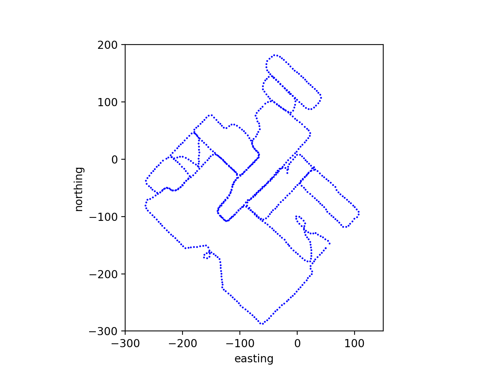

# ITLP-Campus

## Indoor

### Data

| Track | Frames, pcs | Front cam, res | Back cam, res | LiDAR, rays | 6 DoF pose | Semantic masks |
|  :---: | :---: | :---: | :---: | :---: | :---: | :---: |
| 5th_floor_with_loops | $3883$ | $1280\times 720$ | $1280\times 720$ | 16 | &#9745; | None  |
<br/>

6 DoF poses are obtained using Cartographer SLAM with global localization in a pre-built map.

### Sensors

| Sensor | Model | Resolution | 
|  :---: | :---: | :---: | 
| Front cam | ZED (stereo) | $1920\times 1080$ |
| Back cam | RealSense D435 | $1920\times 1080$ |
| LiDAR | VLP-16 | $16\times 1824$ |
<br/>

## Outdoor
The outdor part of this dataset was recorded on the Husky robotics platform on the university campus and consists of 5 tracks recorded at different times of day (day/dusk/night) and different seasons (winter/spring).

### Data

| Track | Season | Time of day | Frames, pcs | Front cam, res | Back cam, res | LiDAR, rays | 6 DoF pose | Semantic masks |
|  :---: | :---: | :---: | :---: | :---: | :---: | :---: | :---: | :---: |
| 00_2023-02-21 | winter | day | $620$ | $1920\times 1080$ | $1920\times 1080$ | 16 | &#9745; | front + back <br/> $1920\times 1080 \times 65$ classes  |
| 01_2023-03-15 | winter| night | $626$ | $1920\times 1080$ | $1920\times 1080$ | 16 | &#9745; | front + back <br/> $1920\times 1080 \times 65$ classes  |
| 02_2023-02-10 | winter | twilight | $609$ | $1920\times 1080$ | $1920\times 1080$ | 16 | &#9745; | front + back <br/> $1920\times 1080 \times 65$ classes  |
| 03_2023-04-11 | spring | day | $638$ | $1920\times 1080$ | $1920\times 1080$ | 16 | &#9745; | front + back <br/> $1920\times 1080 \times 65$ classes  |
| 11_2023-04-13 | spring | night | $631$ | $1920\times 1080$ | $1920\times 1080$ | 16 | &#9745; |  front + back <br/> $1920\times 1080 \times 65$ classes  |
<br/>

6 DoF poses obtained using ALeGO-LOAM localization method refined with Interactive SLAM.

### Sensors

| Sensor | Model | Resolution | 
|  :---: | :---: | :---: | 
| Front cam | ZED (stereo) | $1920\times 1080$ |
| Back cam | RealSense D435 | $1920\times 1080$ |
| LiDAR | VLP-16 | $16\times 1824$ |
<br/>

#### Semantics

Semantic masks are obtained using the [Oneformer](https://github.com/SHI-Labs/OneFormer)  pre-trained on the [Mapillary](https://paperswithcode.com/dataset/mapillary-vistas-dataset) dataset.

The masks are stored as mono-channel images.Each pixel stores a semantic label. Examples of semantic information are shown in the table below:
| Label | Semantic class | Color, [r, g, b] |
|  :---: | :---: | :---: |
| ... | ... | ... | 
| 10 | Parking| [250, 170, 160] |
| 11 | Pedestrin Area | [96, 96, 96] |
| 12 | Rail Track | [230, 150, 140] | 
| 13 | Road | [128, 64, 128] |
| ... | ... | ... | 
<br/>

The complete list of semantic labels and their colors are described in the file [anno_config.json](cfg/anno_config.json).

An example of a mask over the image:


### Structure

The data are organized by tracks, the length of one track is about 3 km, each track includes about 600 frames. The distance between adjacent frames is ~5 m.

The structure of track data storage is as follows:
```text
00_2023-02-21
├── back_cam
│   ├── ####.png
│   └── ####.png
├── demo.mp4
├── front_cam
│   ├── ####.png
│   └── ####.png
├── labels
│   ├── back_cam
│   │   ├── ####.png
│   │   └── ####.png
│   └── front_cam
│       ├── ####.png
│       └── ####.png
├── lidar
│   ├── ####.bin
│   └── ####.bin
├── test.png
├── track.csv
└── track_map.png
```

where

- `####` - file name, which is the timestamp of the image/scan (virtual timestamp of the moment when the image/scan was taken)
- `.bin` - files - LiDAR scans in binary format
- `.png` - images and semantic masks
- `.csv` - timestamp mapping for all data and 6DoF robot poses


An example of a track trajectory  (track_map.png):


